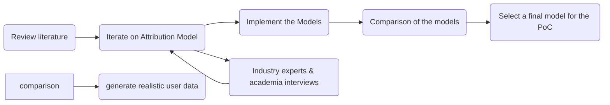

# 🍃 Decentralizing Carbon Accountability 🔗
### A Platform for User-Centric Blockchain Footprints and Offset

**MSc Sustainable Management & Technology**  
**EPFL | IMD Business School | HEC – University of Lausanne**

#### By Mathieu Bélanger

---

This repository contains the research and implementation details of the Master of Science thesis in Sustainable Management and Technology by Mathieu Bélanger, conducted at HEC – University of Lausanne, IMD Lausanne, and École polytechnique fédérale de Lausanne. The thesis, titled "Decentralizing Carbon Accountability: A Platform for User-Centric Blockchain Footprints and Offset," aims to address the environmental impact of blockchain technology through a novel approach to carbon emissions accounting and offsetting.

## Executive Summary

Blockchain technology, notably through its proof-of-work consensus mechanisms, has been criticized for high energy consumption and carbon emissions. This thesis proposes a user-level emissions accounting and offsetting platform, leveraging the transparency of blockchain data to attribute emissions based on user activity and enable carbon offsetting through the purchase of carbon credits.

## Research Framework

### ❓ Why

1. **Problem**: We need  to sell and make more efficient actionable solutions for the climate crisis.
    - Voluntary carbon market: Puts a price on polluting behavior (externalities) at a goods/service producer or end consumer. 
    - Carbon accounting is hard: like traditional accounting, it is prone to errors and fraud.
0. **Opportunity**: Blockchain technology can be key in increasing transparency and bringing real relevancy to the carbon accounting process. **to be worked on**
    - Easier standardization and transparency of data reporting and footprinting process
    - At the blockchain-use level (emissions from using the technology)
    - But also at a more general scope (using blockchain onboarded real-world data as behavior groundtruth for accounting)

0. **Issue**: First Generation Blockchain Technology is extremely energy intensive and sheds a negative connotation on the ecosystem. PoS reduces by 99.9% the carbon externalities
    - We have to provide new incentives for moving the ecosystem away from PoS.
    - We may then more clearly debunk the "blockchain is energy waste" argument.

### 💡 What

- Putting accountability tools in the hands of end users (invest funds, daos, etc) may shine a more relatable light on the energy consumption and emissions of some networks -> Individual user-level carbon footprint.
- We will build a proof-of-concept tool enabling users to measure their blockchain-use emissions and offset them transparently directly on-chain
- This is a first step showcasing how DLTs can help the footprinting and offsetting process, starting with the simpler and accessible/automated data-use-case of user-network interaction data.

 

### 🧰 How

#### Two high-level components:
1. User interface:
    - Secure login for personalized data
    - Visualize usage metrics and historical emissions
    - See overall footprint
    - Guide the user in the offsetting process

2. Backend logic:
    - Emission Attribution Module
    - Automatically fetches users' data

#### Methodology Process:

1. Emission Attribution Module
- Review literature for existing blockchain accounting methodologies
- Iterate on the development of  the attribution model by interviewing experts in the field
- Implement and compare the models on realistic user data
- Select a final model(s) to be used in the PoC tool.

2. Proof-of-concept WebApp

- Connect with third-party data providers:
    - Emissions data (CCRI HTTP API)
    - Blockchain user data (Alchemy SDK)
    - Blockchain network data (Blockchair HTTP API)

- Build reporting frontend:
    - Wallet sign-in
    - User metrics reporting (usage & footprint)
- Build offsetting frontend:
    - Integration with Klima offsetting flow
    - 1-click buy of Klima token + offset

- Host frontend and backend on cloud server

## Thesis Structure

### Introduction

- Overview of blockchain technology and its environmental implications.
- Personal motivations and research questions that guide the thesis.

### Background and Previous Work

- Examination of blockchain sustainability, focusing on different consensus mechanisms and their environmental footprints.
- Literature review on carbon accounting methods applicable to blockchain technology.

### Methodology: Emission Attribution Model

- Development of a new model for attributing blockchain emissions at the user level.
- Comparison of this model with existing approaches using synthetic user data.

### Implementation: GreenBlock Platform

- Description of the GreenBlocks platform, a proof-of-concept tool developed to demonstrate the emission attribution model.
- The platform allows users to estimate their blockchain-related emissions and offset them by purchasing carbon credits.

### Discussion

- Analysis of the results obtained from the GreenBlocks platform.
- Exploration of the broader implications of user-level emissions accounting for blockchain sustainability.

### Conclusion

- Summary of findings and their implications for sustainable blockchain usage.
- Directions for future research in the field of blockchain sustainability and emissions offsetting.

## Acknowledgements

- Me Michel Jaccard, Faculty Lecturer - Enterprise for Society Center, Academic supervisor
- Amine Belghazi, Product Analytics Manager - Ledger, External Expert
