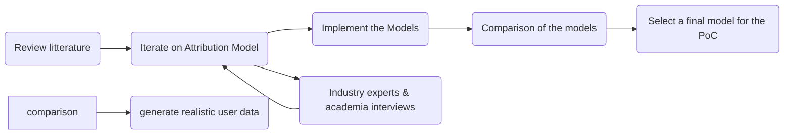

# Greenblocks Master Thesis Defense

## Intro

### ❓ Why

1. **Problem**: We need  to sale and make more efficient actionnable solutions for the climate crisis.
    - Voluntary carbon market: Puts a price on polluting behavior (externalities) at a goods/service producer or end consumer. 
    - Carbon accounting is hard: like traditionnal accounting it is prone to errors and fraud.
0. **Opportunity**: Blockchain technology can be key in increasing transparency and bringing real relevancy to the carbon accounting process. **to be worked on**
    - Easier standardization and transparency of data reporting and footprinting process
    - At the blockchain-use level (emissions from using the technology)
    - But also at a more general scope (using blockchain onboarded real world data as behavior groundtruth for accounting)

0. **Issue**: First Generation Blockchain Technology is extremely energy intensive and sheds negative connotation to the ecosystem. PoS reduces by 99.9% the carbon externalities
    - We have to provide new incentives for moving the ecosystem away from PoS.
    - We may then more clearly debunk the "blockchain is energy waste" argument.

### 💡 What

- Putting accountability tools in the hands of end users (invest funds, daos, etc) may shine a more relatable light on the energy consumption and emissions of some networks -> Individual user-level carbon footprint.
- We will build a proof-of-concept tool enabling users to measure their blockchain-use emissions and offset them transparently directly onchain
- This is a first step showcasing how DLTs can help the footprinting and offsetting process, starting with the simpler and accessible/automated data-use-case of user-network interaction data.

 

### 🧰 How

#### Two high-level components:
1. User interface:
    - Secure login for personalized data
    - Visualize usage metrics and historical emissions
    - See overall footprint
    - Guide the user in the offsetting process

2. Backend logic:
    - Emission Attribution Module
    - Automatically fetches users data

#### Methodology Process:

1. Emission Attribution Module
- Review litterature for existing blockchain accounting methodologies
- Iterate on the development of  the attribution model by interviewing experts in the field
- Implement and compare the models on realistic user data
- Select a final model(s) to be used in the PoC tool.

2. Proof-of-concept WebApp

- Connect with third party data providers:
    - Emissions data (CCRI HTTP API)
    - Blockchain user data (Alchemy SDK)
    - Blockchain network data (Blockchair HTTP API)

- Build reporting frontend:
    - Wallet sign-in
    - User metrics reporting (usage & footprint)
- Build offsetting frontend:
    - Integration with Klima offsetting flow
    - 1-click buy of Klima token + offset

- Host frontend and backend on cloud server